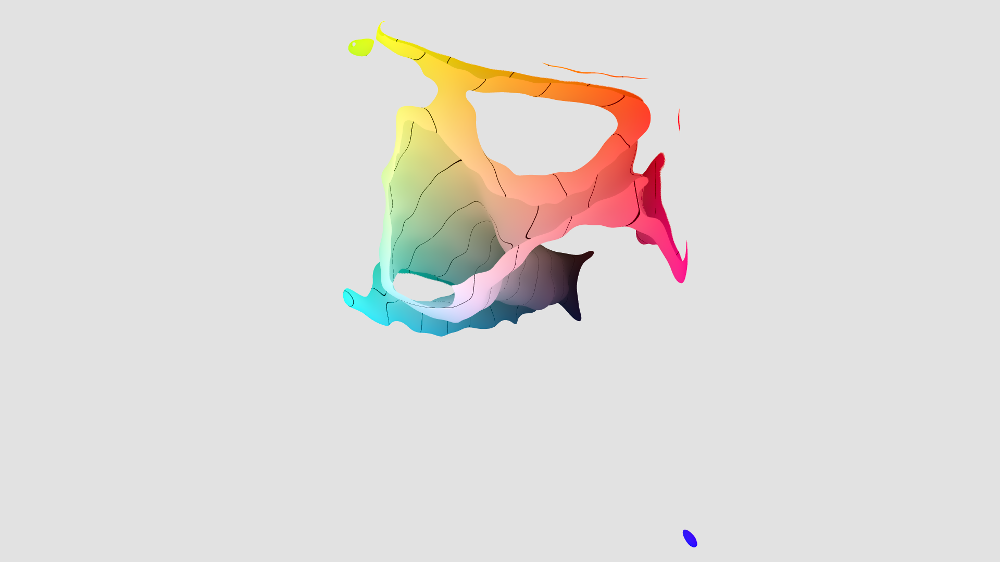

Colour Visualization is my personal project for exploring colour distributions. The software is comprised of a custom ray-casting raytracer that creates animation frames of colours, given an opacity map for the set of all colours. This opacity map comes from the fast Gaussian transform of the kernel density estimate of a colour sample in the CIE Lab colour space. To break this down:

- The CIE Lab colour space is a three-dimensional representation of colour, in which every colour is mapped to a different point, and the distance between any two points closely corresponds to human perception of the difference between the corresponding colours.
- A kernel density estimate is a statistical technique generalizing from samples (e.g. how popular some specific colours are) to all colours.
- The fast Gaussian transform is an approximation technique that computes the kernel density estimate equally quickly for a dataset of any size.
- A ray-casting raytracer traces lines from the camera outward, computing the popularity of all colours it passes on the way, creating a kind of photograph.

Along with algorithmic and mathematical optimization, the raytracer makes heavy use of SIMD instructions and multithreading.

## The Colour Lovers Dataset

The first use case of it is an animated exploration of a colour preference dataset from the website [colourlovers.com](colourlovers.com). The dataset is comprised of, roughly, 3 million votes over 1.8 million different colours. As a first experiment, the camera rotates around the colour set, while adjusting colour opacity to show all colours with the same popularity, going from the most to the least popular.

